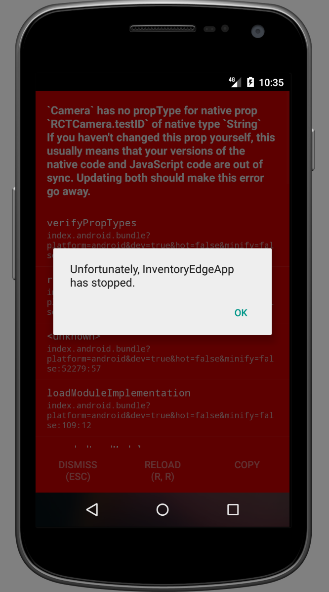

# react native 常见问题
> 欢迎补充

### 0x001

> Cannot add a child that doesn't have a CSS node to a node without a measure function!

> 语义不规范/组件不兼容

### 0x002： react-native初始化项目时候报错

> Couldn't find package "xxx" on the "npm" registry.

> Command failed: yarn add xxx --exact

提示在npm仓库里没有xxx的版本

#### 解决方案
（1）如果使用`--version`参数创建指定版本的项目，版本号必须精确到两个小数点。
```cmd
react-native init MyApp --version 0.39.2
```
（2）如果没解决的话请试试：

```cmd
npm config set registry https://registry.npm.taobao.org

```

```cmd
npm config set disturl https://npm.taobao.org/dist

```

### 0x003：React/RCTBundleURLProvider.h file not found
OS: `rn0.40+`
(1)解决方案：
- Try the following:
 - Clean (`cmd+shift+K`).
 - Build core React - select React as the scheme in Xcode and build it (`cmd+B`).
 - Build the library that is failing (e.g. RCTText).
 - Build your app.

(2)尝试一下操作
- 删除`node_modules`文件夹 - `rm -rf node_modules` && `npm install`
 - 重置包装缓存 - rm -fr $TMPDIR/react-* or node_modules/react-native/packager/packager.sh --reset-cache
 - Clear watchman watches - watchman watch-del-all

### 0x004：react native打包后image无法显示
> [react native打包后image无法显示，debug下却可以](https://my.oschina.net/u/1460994/blog/802181)

### 0x005: React Native开发错误警告总结
> [React Native开发错误警告总结（持续更新](http://www.jianshu.com/p/98c8f2a970eb)

### 0x006: 平台适配
- 初期 (不建议)
 1.Android中图片放在android\app\src\main\res下(文件夹名:drawable-xxhdpi),并且图片名都是小写
 2.Ios中进入ios\MobileCampus\下,删除Images.xcassets文件夹下的东西,复制你的图片
- 后期 (推荐)
 ....

### 0x007: react native USB真机调试报错
> com.android.builder.testing.api.DeviceException: com.android.ddmlib.InstallException: Unable to upload some APKs

[解决方法](http://csbun.github.io/blog/2015/12/starting-react-native-with-android/)

### 0x008: React Native Reload不更新
```
解决方案:
例如:E:\Study\node_modules\react-native\packager\react-packager\src\node-haste\FileWatcher\index.js
```
找到`_createWatcher`关键字并更改相应代码:
```
const MAX_WAIT_TIME = 360000;

_createWatcher(rootConfig) {
    const watcher = new WatcherClass(rootConfig.dir, {
      glob: rootConfig.globs,
      dot: false,
    });
    return new Promise((resolve, reject) => {
      const rejectTimeout = setTimeout(
        () => reject(new Error([
            'Watcher took too long to load',
            'Try running `watchman version` from your terminal',
            'https://facebook.github.io/watchman/docs/troubleshooting.html',
          ].join('\n'))),
        MAX_WAIT_TIME
      );
      watcher.once('ready', () => {
        clearTimeout(rejectTimeout);
        resolve(watcher);
      });
    });
  }
```

### 0x00a: ListView不滑动
```
解决方法：listview自身和它的父容器都要加flex：1,哪层断了都不行

相关解决方法:[stackoverflow](http://stackoverflow.com/questions/32874559/listview-fails-to-scroll);
```

#### 0x00b: Genymotion使用问题

> 在操控Genymotion时,鼠标左右滑动会切换到自动搜索,搜索框中自动输入0003,这问题搞得我当时很头痛,最后发现是因为开启的有道词典的划词取词导致这样,关闭有道或者取消划词取词功能;

#### 0x00c: 安卓禁止禁止横屏：
> ..\android\app\src\main\AndroidManifest.xml

> 添加： 找到android:name=".MainActivity" 

> 添加属性： android:screenOrientation="portrait"

#### 0x00d: image not found 出现 lldb 命令
> 说明程序崩溃，自动进入debug

> 低版本手机里,Xocde的高版本Framework不支持.

```
dyld: Library not loaded: /System/Library/Frameworks/UserNotifications.framework/UserNotifications
  Referenced from: /Users/xxx/Library/Developer/CoreSimulator/Devices/1861D915-BD31-4DA8-B9FC-BAD82B56FF14/data/Containers/Bundle/Application/B9EAEF7A-20FA-4106-8282-4C97C351B787/YouProjectName.app/YouProject
  Reason: image not found
  (lldb)
```
解决方案
```
target下的Build Phases标签里,找到Link Binary With Libraries,在里面找到UserNotifications.framework,把status由Required 修改成Optional，然后再运行就
```

#### 0x00e: Camera has no propType for native prop RCTCamera.testID of native type String
<div align = center>
	
</div>

> [react-native-camera pr 解决方案](https://github.com/lwansbrough/react-native-camera/pull/718/files)


 


